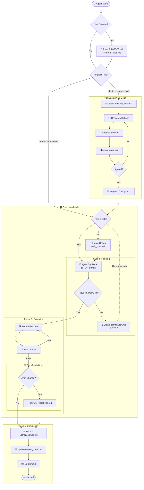

# Universal Agent Protocol v4: Process Flow & Edge Cases

## Edge Case Explanations
1.  **The Fork (ModeCheck)**: The workflow splits immediately. If you just want to "Think," we don't pollute the Task Plan yet. We loop in the "Ideation" subgraph until we agree on a solution.
2.  **Consensus -> Plan**: Once we agree on an idea, the result (MergeFacts) feeds *directly* into the Execution Mode (`PlanCheck`), turning thoughts into Actionable Items.
3.  **Clarification vs Ideation**:
    *   **Ideation**: "What should we build?" (Creative).
    *   **Clarification**: "How precisely should I build this feature?" (Technical constraint checking).
